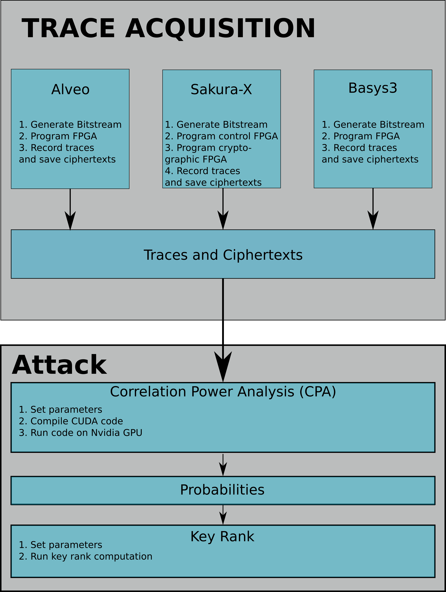
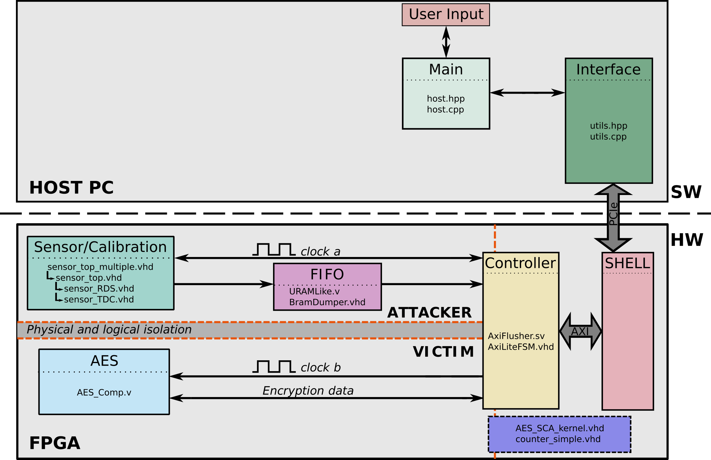
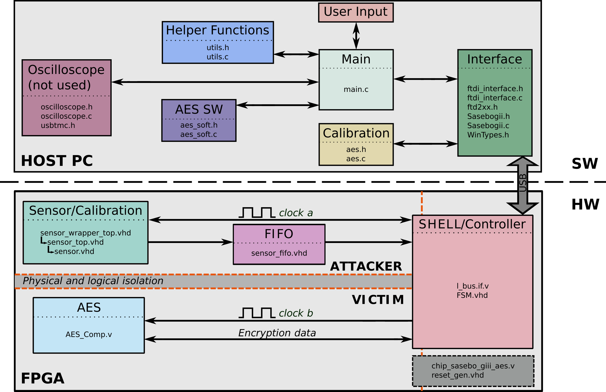
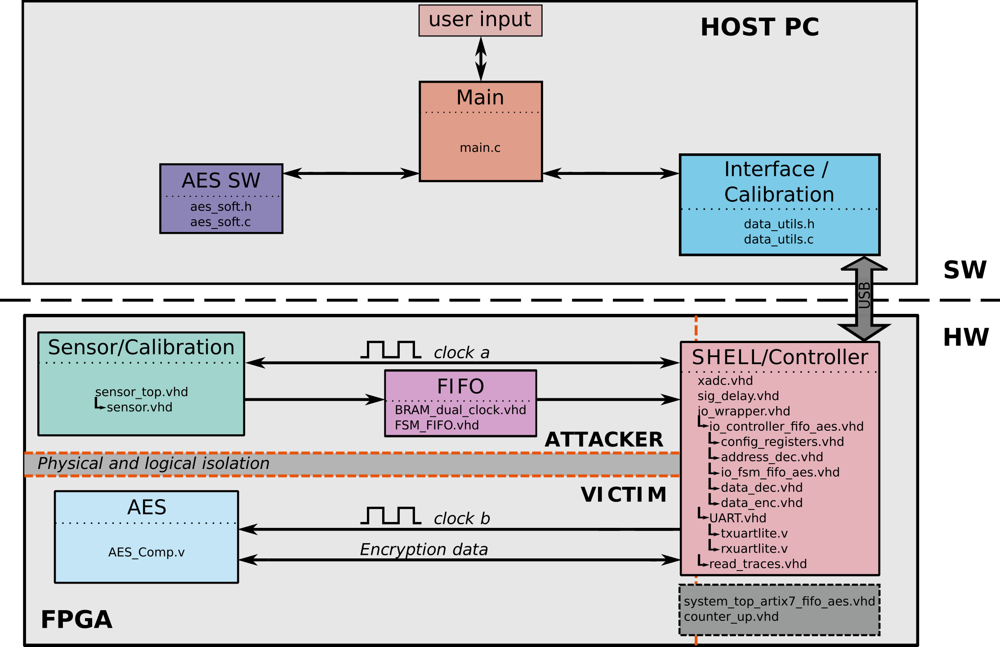

# RDS: FPGA Routing Delay Sensors for Effective Remote Power Analysis Attacks

This directory contains the design files corresponding to the TCHES'23 paper "RDS: FPGA Routing Delay Sensors for Effective Remote Power Analysis Attacks" by David Spielmann, Ognjen Glamočanin, and Mirjana Stojilović.

```
Overview:
│   │
│   └───README.md
│   │
│   └───LICENSE.md
│   │
│   └───description_hw.md: Description of all hardware modules used in the project.
│   │
│   └───description_sw.md: Description of all software functions used in the project.
│
└───alveo/
│   │
│   └───bitstreams/: Directory containing the bitstreams used for the experiments on the Alveo U200 Datacenter Card.
│   │
│   └───constraints/: Directory containing the constraints for RDS and TDC sensors.
│   │
│   └───rtl/: Directory containing the hardware files needed to create the project of the Alveo U200 Datacenter Card.
│   │
│   └───soft/: Directory containing all the software files need to collect the power traces on the Alveo U200 Datacenter Card.
│   │
│   └───tcl/: Directory containing the files that automatically create the project in Vivado by using the files from hw/.
│
└───basys3/
│   │
│   └───bitstream/: Directory containing the bitstream used for the temperature experiments on the Digilent Basys 3 board.
│   │
│   └───create_project_AES50MHz_SENSOR200MHz.tcl: TCL file that automatically creates the project in Vivado.
│   │
│   └───hw/: Directory containing all the hardware files needed to create the project of the Digilent Basys 3 board.
│   │
│   └───sw/: Directory containing the software files needed to collect the power traces on the Digilent Basys 3 board.
|
└───figures/: Directory containing the figures of this readme.
│
└───key_rank/: Directory containing the tools required for performing a CPA attack using a collected trace set.
|
└───sakura_x
    │
    └───bitstreams/: Directory containing all the bitstreams used on the Sakura-X board. The type of the sensor is specified by the name of the folder. The placement of the sensor and the AES is specified in the name of the bitstream.
    │
    └───hw/: Directory containing all the hardware files needed to create the project on the Sakura-X board.
    │    │
    │    └───tcl/: Directory containing the TCL scripts to automatically set up a project in Vivado with the desired on-chip sensor.
    │
    └───sw/: Directory containing the software files needed to collect the power traces on the Sakura-X board.

```
# Methodology

Fig. 1 shows the trace acquisition methodology used in our paper. For all three boards (Alveo U200, Sakura-X, and Basys3), we follow the same methodology. We first generate the bitstreams, program the FPGA, and collect the AES power traces and ciphertexts. Using the generated data, we run the CPA attack and calculate the key rank estimation metric.
    <div style="text-align:center"></div>
    <p style="text-align: center;">Figure 1</p>

# Trace Acquisition

## Alveo U200 Datacenter Card

The RDS sensor implementation file is located in: `alveo/rtl/sensor/sensor_RDS.vhd`. For more details on both the software and hardware modules, please refer to the `description_sw.md` and `description_hw.md` files.

### System Architecture

Fig. 2 shows the architecture of the system used to collect traces on the Alveo U200 board, with each component containing the HDL files that describe it.
    <div style="text-align:center"></div>
    <p style="text-align: center;">Figure 2</p>

### Running the Experiments

Follow these steps to collect power traces on the Alveo U200 Datacenter Card. The Alveo U200 experiments were built and run on Ubuntu 20.04.

<details>
<summary>Generating the bitstream (optional)</summary>

1. Install Vitis/Vivado and XRT library
    * Experiments done on Vitis 2021.1, XRT library 2.11.634 (2021.1); with bitstreams in `alveo/bitstreams/host/shell_v1/`
    * Also works with Vitis 2022.1, XRT library 2.13.466 (2022.1); bitstreams in `alveo/bitstreams/host/shell_v2/`
2. In `alveo/tcl`, run `make impl_tdc` to generate the TDC bitstream
3. In `alveo/tcl`, run `make impl_rds` to generate the RDS bitstream
4. Bitstream will be generated in `alveo/tcl/bin`
</details>

<details>
<summary>Running the experiments </summary>

1. In `alveo/soft/`, run `make`
2. For a single experiment, run the host command:
    * `./host <path_to_bitstream>/aes_sca.xclbin <number_of_sensors: only 1 supported> <number_of_samples> <sensor_width> <IDC_size> <IDF_size: max 32> <number_of_traces: max 96> <calibration_file_path> <output_path> <AES_key> <calibration_type: 0 automatic TDC, 1 automatic RDS, 2 from file> <temperature: 0 for not recording temperature, 1 for recording temperature>`
3. To run TDC experiments for multiple keys:
    * `./regression_TDC.sh`
4. To run RDS experiments for multiple keys:
    * `./regression_RDS.sh`
5. To run repeated experiments for both RDS and TDC for multiple keys:
    * `./regression_all.sh`

* **NOTE**: The `host.cpp` software first programs the FPGA with a "dummy" bitstream (`alveo/bitstreams/shell_v2/verify.xclbin`) which is provided by Xilinx, and after programs the FPGA with the bitstream passed with the `<path_to_bistream>` argument. Since XRT skips the reprogramming process if the same bitstream is consecutively used, we use the dummy bitstream to force XRT to reprogram the FPGA with a fresh bitstream each time we launch the host program. As a consequence, the initial part of the host program lasts longer (~30s), since two consecutive bistream programming processes happen.
</details>
<details>
<summary>Generated files</summary>

1.  Each run generates five files:
    * `traces_encoded.bin`, containing `N_TRACES` traces, each with `N\_SAMPLES` `uint8_t` values, stored in binary format
    * `traces_raw.bin`, containing `N_TRACES` traces, each with `N\_SAMPLES` hex values of `SENSOR_WIDTH` bits, representing the non-encoded output of the delay line, stored in binary format
    * `ciphertexts.bin`, containing one 16-byte value per trace, in binary format, stored in the same order as the power traces, representing the ciphertexts of the traces
    * `keys.bin`, containing one 16-byte value per trace, in binary format, stored in the same order as the power traces, representing the keys of the traces
    * `temperatures.csv`, containing temperature information recorded every 100000 traces
    * In case of a regression, these files are stored in separate folders for each key, and each experiment repetition
</details>

## Sakura-X Side-Channel Evaluation Board

The RDS sensor implementation file is located in: `sakura_x/hw/sources/RDS/sensor.vhd`.

### System Architecture

Fig. 3 shows the architecture of the system used to collect traces on the Sakura-X board, with each component containing the HDL files that describe it. For more details on both the software and hardware modules, please refer to the `description_sw.md` and `description_hw.md` files. 
    <div style="text-align:center"></div>
    <p style="text-align: center;">Figure 3</p>

### Running the Experiments

Follow these steps to collect power traces on the Sakura-X board. The Sakura-X experiments were built and run on Ubuntu 20.04.

<details>
<summary>Bitstream Generation (optional)</summary>

1. Install Vivado and the D2XX driver for the FTDI chip on the Sakura-X board
    * Experiments done on Vivado 2018.3, and using version 1.4.24 of the libftd2xx driver
2. Start Vivado 2018.3. When Vivado is started, a TCL command-line interface appears in the lower part of the GUI. Use this TCL command-line interface to change the directory:
   ```bash
      cd sakura_x/hw/tcl
   ```
3. Give a name to your project as follows:
   ```bash
      set project_name <your_project_name>
   ```
4. Choose your desired sensor and execute the corresponding TCL script, e.g.,
   ```bash
      source create_vivado_project_rds.tcl
   ```
5. Vivado automatically creates the project. To implement the design, hit the `Run Implementation` button.
6. Click on the `Generate Bitstream` button to generate the bitstream of the implementation.
</details>

<details>
<summary>Trace Acquisition</summary>

1. Use a USB 2.0 A/B cable to power the Sakura-X board. Connect the USB A end of the cable to the host PC, and the USB type B end to the CN15 connector on Sakrura-X board.
2. Switch on the Sakura-X board by changing the SW1 power switch to the `USB` position.
3. Connect the programming cable to the PC and to the control FPGA programming connector (CN10 on the Sakura-X board).
4. Program the control FPGA of the Sakura-X board with the bitstream `sakura_x/bitstreams/ctrl/sasebo_giii_ctrl_20MHz.bit`.
5. Disconnect the programming cable from the control FPGA connector (CN10 on the Sakura-X board), and connect it to the main FPGA programming connector (CN5 on the Sakura-X board).
6. Program the cryptographic FPGA with the bitstream that has been generated in point 6.
7. In case the **Digilent JTAG-HS3 Programming Cable** is used with the Sakura-X board, skip this step. In case the **Xilinx Platform Cable USB II** is used, the following changes need to be made to the code:
    * In line 20 of the `sakura_x/sw/Sasebogii.c` file, the call to the `setup_device()` function should be changed from `setup_device(B, handle)` to `setup_device(A, handle)`

8. Compile the software part in the directory `sakura_x/sw` by typing `make`. The source code has the following software dependencies:
    * `liblibftd2xx.so`
    * `libpthread.so.0`
    * `libc.so.6`
  
9. Change to the following directory: `sakura_x/sw/Debug` and execute the two scripts:
    * `setupFTD.sh`
    * `unload_sio.sh`
  
10. Choose a location to save the traces and create a directory, e.g., `mkdir experiment_6_1`. The created directory is used as the input for the argument `-d` in point 11.
11. The software comes along with a help message. Display the help message by typing `./FTDexamplesAES -help`. The help message describes all the arguments needed to collect the power traces. For example, for the experiments in Section 6.1, the following command was used:
    `./FTDexampleAES -k 2 -uk 7d266aecb153b4d5d6b171a58136605b -pm 1 -t 100000 -d traces/experiment_6_1 -c 4 -s 128 -r 128`.
</details>

## Digilent Basys 3 Board

The RDS sensor implementation file is located in: `basys3/hw/rtl/sensor/sensor.vhd`.

### System Architecture

Fig. 4 shows the architecture of the system used to collect traces on the Basys3 board, with each component containing the HDL files that describe it. For more details on both the software and hardware modules, please refer to the `description_sw.md` and `description_hw.md` files. 
    <div style="text-align:center"></div>
    <p style="text-align: center;">Figure 4</p>

### Running the Experiments

Follow these steps to collect power traces on the Digilent Basys 3 board. The Basys 3 experiments were built and run on Ubuntu 20.04.

<details>
<summary>Bitstream Generation (optional) and Trace Acquisition</summary>

1. Install Vivado, add Basys 3 board files to the Vivado installation directory, and install the USB cable drivers
    * Experiments done on Vivado 2018.3, using the cable driver from the Vivado installation path
2. Start Vivado 2018.3. When Vivado is started, a TCL command-line interface appears in the lower part of the GUI. Use this TCL command-line interface to change the directory:
   ```bash
      cd basys3
   ```
3. Give a name to your project as follows:
   ```bash
      set project_name <your_project_name>
   ```
4. Execute the TCL script by typing `source create_project_AES50MHz_SENSOR200MHz.tcl`.
5. Vivado automatically creates a project which implements the RDS sensor. To implement the design, hit the `Run Implementation` button.
6. Click on the `Generate Bitstream` button to generate the bitstream of the implementation.
7. Program the FPGA with the bistream that has been generated in point 5.
8. Compile the software part in the directory `basys3/sw` by typing `make`.
9. Change to the directory `basys3/sw/bin`. The software comes along with a help message. Display the help message by typing `./interface -help`. The help message describes all the arguments needed to collect the power traces. For example, for the experiments in Section 6.5, the following command was used: `./interface -k 0 -pt 1 -t 70000 -s -d traces/experiment_6_5 `.
</details>

# Attack

##  Correlation Power Analysis (CPA) and the Computation of the Key Rank Estimation

```
Content: key_rank/
  |CPA_GPU.cu             : Main CUDA source file, containing the CPA key rank estimation attack.
  |data.cuh               : Header file.
  |utils.cu               : Source file containing the utils such as argument parsing and printing functions.
  |utils.cuh              : Utils header file.
  |Makefile               : Makefile for the CUDA CPA attack.
  |launch_attack.py       : PYTHON script for launching the complete attack (it compiles the CUDA code and runs all the required scripts and programs for the attack).
  |calculate_keyrank.py   : PYTHON script for generating the Key Rank.
  |convert_traces.py      : PYTHON script for generating a .data file that contains the traces, from a .bin file.
  |convert_ciphertexts.py : PYTHON script for generating a .data file that contains the ciphertexts, from a .bin file. 

```
Attack process:

0. Install the CUDA driver and compiler on a machine with an NVIDIA GPU. Install python3 and python pandas and numpy libraries.
1. Run the `launch_attack.py` script. Use the `-h` option for help. It prints the following help:

```
usage: launch_attack.py [-h] -k KEY -t TRACE_FILE -c CIPHERTEXTS_FILE -nt N_TRACES -ns N_SAMPLES -ss STEP_SIZE -o OUTPUT_PATH

==================================================
CPA Key Rank Estimation Attack

==================================================

Short summary:
	- This program takes the power consumption traces, ciphertexts, and the last round key and computes the log2 key rank estimation metric using CPA.
	- The ouput of this program are the upper and lower bounds of the log2(key rank) metric, in a .csv file.

optional arguments:
  -h, --help            show this help message and exit
  -k KEY, --key KEY     Last round key of 16 bytes, in hexadecimal value.
                        Example: -k e07f16bdb9e50346a2277cd382774270
  -t TRACE_FILE, --trace_file TRACE_FILE
                        Path to trace file.
                        Example: -t /home/user/documents/data/traces.bin
  -c CIPHERTEXTS_FILE, --ciphertexts_file CIPHERTEXTS_FILE
                        Path to ciphertext file.
                        Example: -c /home/user/documents/data/ciphertexts.bin
  -nt N_TRACES, --n_traces N_TRACES
                        Number of traces (encryptions) in the trace file.
                        Example: -nt 10000
  -ns N_SAMPLES, --n_samples N_SAMPLES
                        Number of sampler per trace (trace length).
                        Example: -ns 128
  -ss STEP_SIZE, --step_size STEP_SIZE
                        Step size for the attacks.
                        Example: -ss 1000
  -o OUTPUT_PATH, --output_path OUTPUT_PATH
                        Path to output directory.
                        Example: -o /home/user/documents/data/results/
```

2. Example

```
python3 launch_attack.py -k e07f16bdb9e50346a2277cd382774270 -t ~/work/tmp/data/sensor_traces_hw_100k.bin -c ~/work/tmp/data/ciphertexts.bin -nt 100000 -ns 128 -ss 1000 -o ~/work/tmp/results/
```

3. Cautions:

* The GPU must have sufficient memory to store the traces, otherwise the attack runs out of memory.
* The original traces that are transformed by the attack script must be in the following format:
  * Each trace consists of `N_SAMPLES` samples, stored as a binary array of `uint8_t` values as such (in C syntax): `uint8_t trace_array[N_SAMPLES];`
  * The traces are stored consecutively in the binary file, using a similar command as this one in a loop (in C syntax): `fwrite(trace_array, sizeof(trace_array[0]), N_SAMPLES, trace_file_f);`
* The original ciphertexts that are transformed by the attack script must be in the following format:
  * Each ciphertext consists of 16 bytes, stored as a binary array of `uint8_t` values as such (in C syntax): `uint8_t ciphertext[16];`
  * The ciphertexts are stored consecutively in the binary file, using a similar command as this one in a loop (in C syntax): `fwrite(ciphertext, sizeof(ciphertext[0]), N_SAMPLES, ciphertext_file_f);`
* The `N_SAMPLES` and `N_TRACES` parameters must match the number of traces and samples in the `.bin` files

